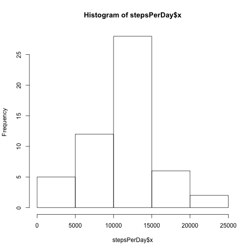
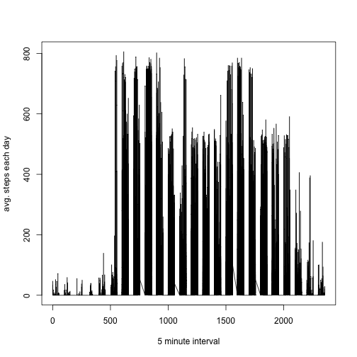
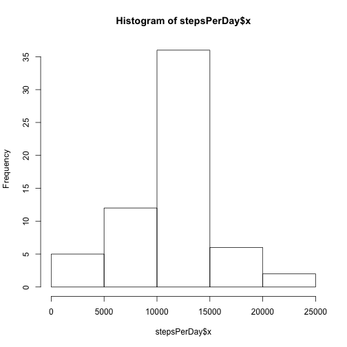
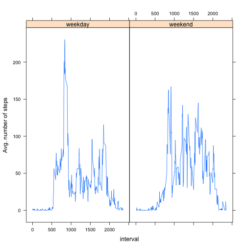

# Reproducible Research: Peer Assessment 1
 

## Loading and preprocessing the data

Load the data (i.e. read.csv())

```r
activityData <- read.csv("./activity.csv")
```
Process/transform the data (if necessary) into a format suitable for your analysis

```r
cleanActivityData <- na.omit(activityData)
cleanActivityData$date <- as.Date(cleanActivityData$date)
```


## What is mean total number of steps taken per day?
Make a histogram of the total number of steps taken each day

```r
stepsPerDay <- aggregate(cleanActivityData$steps, by=list(day = cleanActivityData$date), sum)
hist(stepsPerDay$x)
```

 
Calculate and report the mean and median total number of steps taken per day

```r
mean(stepsPerDay$x)
```

```
## [1] 10766
```

```r
median(stepsPerDay$x)
```

```
## [1] 10765
```

## What is the average daily activity pattern?
Make a time series plot (i.e. type = "l") of the 5-minute interval (x-axis) and the average number of steps taken, averaged across all days (y-axis)

```r
stepsAvgEveryFiveMin <- aggregate(cleanActivityData$steps, 
                                  by=list(day = cleanActivityData$date, interval = cleanActivityData$interval),
                                  mean)
plot(stepsAvgEveryFiveMin$interval, stepsAvgEveryFiveMin$x, type="l", xlab = "5 minute interval", ylab = "avg. steps each day")
```

 

Which 5-minute interval, on average across all the days in the dataset, contains the maximum number of steps?

5 min. interval with most steps:

```r
stepsAvgEveryFiveMin[which(stepsAvgEveryFiveMin$x == max(stepsAvgEveryFiveMin$x)), 2]
```

```
## [1] 615
```

## Imputing missing values
Note that there are a number of days/intervals where there are missing values (coded as NA). The presence of missing days may introduce bias into some calculations or summaries of the data.

Calculate and report the total number of missing values in the dataset (i.e. the total number of rows with NAs)

Number of missing values:

```r
completeRecords <- complete.cases(activityData)
rowsWithNA <- activityData[!completeRecords,]
nrow(rowsWithNA)
```

```
## [1] 2304
```

Devise a strategy for filling in all of the missing values in the dataset. The strategy does not need to be sophisticated. For example, you could use the mean/median for that day, or the mean for that 5-minute interval, etc.

Here we create the avg. steps per interval to fill in the data:

```r
meanStepsPerInterval <- aggregate(cleanActivityData$steps, by=list(interval = cleanActivityData$interval), mean)

for(i in 1:nrow(meanStepsPerInterval)) {
        rowsWithNA$steps[ which(rowsWithNA$interval == meanStepsPerInterval[i,1]) ] <- ceiling(meanStepsPerInterval[i,2]) # round up, since you can't take half a step;)       
}
```

Create a new dataset that is equal to the original dataset but with the missing data filled in.

```r
for(i in rownames(rowsWithNA)) {
        activityData[i,1] <- rowsWithNA[i,1]             
}
```

Make a histogram of the total number of steps taken each day and Calculate and report the mean and median total number of steps taken per day. Do these values differ from the estimates from the first part of the assignment? What is the impact of imputing missing data on the estimates of the total daily number of steps?

The histogram is similar to the original, but the frequency is higher in the 10,000-15,000 range.

```r
activityData$date <- as.Date(activityData$date)
stepsPerDay <- aggregate(activityData$steps, by=list(day = activityData$date), sum)
hist(stepsPerDay$x)
```

 
Mean & Median with filled in data.  It appears that even after filling in the data using the avg. steps per-interval that it had a somewhat minor impact on the "mean" steps.

```r
mean(stepsPerDay$x)
```

```
## [1] 10785
```

```r
median(stepsPerDay$x)
```

```
## [1] 10909
```

## Are there differences in activity patterns between weekdays and weekends?

Create a new factor variable in the dataset with two levels – “weekday” and “weekend” indicating whether a given date is a weekday or weekend day.

Factor variable creation below:

```r
weekdayActivities <- weekdays(activityData$date)
weekdayActivities[weekdayActivities %in% c("Saturday", "Sunday")] <- "weekend"
weekdayActivities[weekdayActivities %in% c("Monday","Tuesday", "Wednesday", "Thursday", "Friday")] <- "weekday"
weekdayActivities <- as.factor(weekdayActivities)
```

Make a panel plot containing a time series plot (i.e. type = "l") of the 5-minute interval (x-axis) and the average number of steps taken, averaged across all weekday days or weekend days (y-axis). The plot should look something like the following, which was creating using simulated data:

Aggregate steps by weekdayActivities (factor) and interval

```r
weekendAndWeekdaystepsAvgEveryFiveMin <- aggregate(activityData$steps, 
                                                   by=list(dayOfWeek = weekdayActivities, interval = activityData$interval),
                                                   mean)
library(lattice)
xyplot(x ~ interval | dayOfWeek, weekendAndWeekdaystepsAvgEveryFiveMin, type="l", ylab = "Avg. number of steps")
```

 

